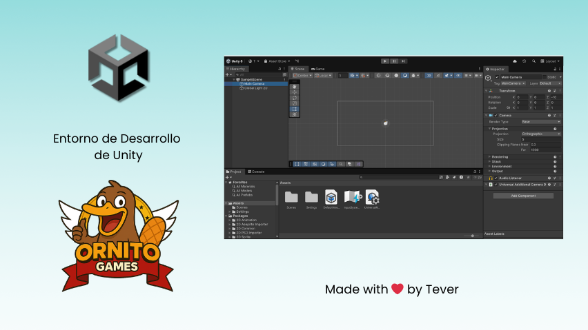

# 🔎​ Conoce el Entorno de Desarrollo de Unity

[](https://github.com/devTever)

## 1) Crear un nuevo proyecto
- Abre Unity Hub → **New Project**
- Elige la plantilla **2D**
- Ponle nombre (ejemplo: *Prueba*).  
- Selecciona la carpeta donde guardar y haz clic en **Create Project**.  

---

## 2) Espacio de trabajo de Unity con sus lugares
Observa las **ventanas principales**:  
- **Scene (Escena):** donde colocamos y organizamos objetos.  
- **Game (Juego):** vista previa de cómo se verá al ejecutar.  
- **Hierarchy (Jerarquía):** lista de todos los objetos de la escena.  
- **Inspector:** donde editamos las propiedades del objeto seleccionado.  
- **Project:** donde están los archivos del proyecto (scripts, imágenes, sonidos, etc.).  
- **Console:** mensajes, errores y avisos.  

---

## 3) Ejemplo sencillo de un texto con un botón
1. **Crear UI básica**:  
   - Menú `GameObject → UI → Text (TMP)` → aparecerá un texto.  
   - Cámbialo en el Inspector a: **"Hola, toca el botón"**.  
   - Ajusta la posición para que quede visible.  

2. **Crear botón**:  
   - `GameObject → UI → Button (TextMeshPro)`  
   - Cambia el texto del botón a “Tocar”.  

3. **Crear script**:  
   - En la carpeta *Scripts* → `BotonTexto.cs`
     
   ```csharp
   using UnityEngine;
   using TMPro;   // Necesario para usar TextMeshPro
   using UnityEngine.UI;
   
   public class BotonTexto : MonoBehaviour
   {
       public TMP_Text mensaje;
   
       public void CambiarTexto()
       {
           // Cambia el texto en pantalla
           mensaje.text = "Has tocado el botón";
   
           // Muestra mensaje en la consola de Unity
           Debug.Log("El botón fue pulsado. Texto cambiado a: " + mensaje.text);
       }
   }
   ```

4. **Configurar**:  
   - Arrastra el script al botón.  
   - En el componente, asigna el objeto **Texto** en la variable `mensaje`.  
   - En el botón → `OnClick()` → arrastra el botón y selecciona `BotonTexto → CambiarTexto()`.  

---

## 4) [Recomendación] Tener Visual Studio Code como editor de código
- Es ligero y rápido.  
- Instalar **Visual Studio Code** desde su [web oficial](https://code.visualstudio.com/)
- Plugins recomendados:  
  - *C#* (de Microsoft)  
  - *Unity Tools*  
  - *Debugger for Unity*  
  - *Unity Snippets* (atajos de código)  

---

## 5) Probar el ejercicio
- Vuelve a Unity.  
- Haz clic en **Play ▶️**.  
- Muestra el texto inicial: *“Hola, toca el botón”*.  
- Haz clic en el botón y que cambie a: *“Has tocado el botón”*.

---

## 6) Pequeña mejora
- En la carpeta *Scripts* → `BotonTexto.cs`
- Añadimos contador e incrementamos cada vez que hacemos clic
     
   ```csharp
   using UnityEngine;
   using TMPro;   // Necesario para usar TextMeshPro
   using UnityEngine.UI;
   
   public class BotonTexto : MonoBehaviour
   {
       public TMP_Text mensaje;
       int numVeces = 0;
   
       public void CambiarTexto()
       {
           numVeces++;
           // Cambia el texto en pantalla
           mensaje.text = "Has tocado el botón " + numVeces + " veces";
   
           // Muestra mensaje en la consola de Unity
           Debug.Log("El botón fue pulsado. Texto cambiado a: " + mensaje.text);
       }
   }
   ```


---

## 7) Video con el ejercicio

Haz click en la imagen 😉

[](https://www.youtube.com/watch?v=KqW8t_Sr20k)

---

[](https://github.com/devTever)
